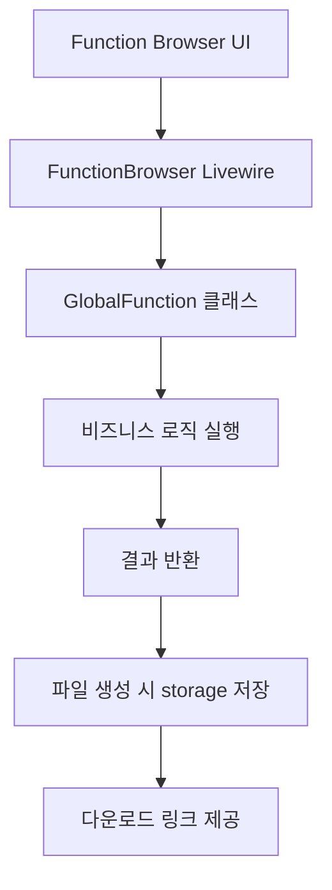
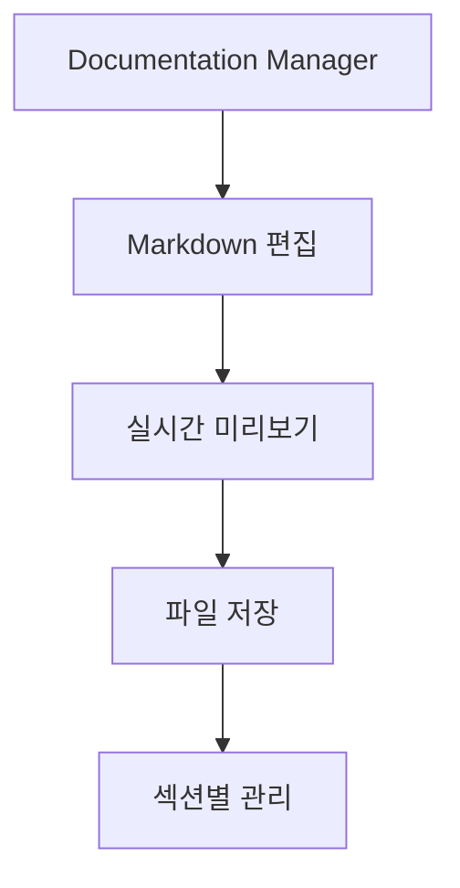

# 프로젝트 아키텍처

## 🏛️ 전체 구조 개요

```
PlobinProtoV3-2/
├── app/
│   ├── Http/
│   │   ├── Sandbox/GlobalFunctions/    # Global Functions 라이브러리
│   │   └── Controllers/                # 컨트롤러
│   ├── Livewire/                      # Livewire 컴포넌트
│   └── Models/                        # Eloquent 모델
├── resources/
│   └── views/
│       ├── 700-page-sandbox/          # 샌드박스 페이지
│       └── livewire/sandbox/          # Livewire 뷰
├── routes/
│   └── web.php                        # 웹 라우트 정의
└── storage/
    └── app/
        ├── sandbox-exports/           # 내보낸 파일 저장소
        └── sandbox-documentation/     # 문서 저장소
```

## 📋 핵심 컴포넌트

### 1. GlobalFunctions 시스템
**위치:** `app/Http/Sandbox/GlobalFunctions/`

유틸리티 함수들을 모듈화하여 관리하는 시스템입니다.
- 추상 베이스 클래스로 표준화된 인터페이스 제공
- 플러그인 방식으로 새로운 기능 추가 가능
- Function Browser를 통한 실시간 테스트

### 2. Livewire 기반 UI
**위치:** `app/Livewire/Sandbox/`

실시간 상호작용이 가능한 사용자 인터페이스를 제공합니다.
- 페이지 새로고침 없는 동적 UI
- 서버사이드 렌더링으로 SEO 최적화
- Alpine.js와 연동된 클라이언트 사이드 기능

### 3. 샌드박스 도구 생태계
**위치:** `resources/views/700-page-sandbox/`

개발 효율성을 위한 통합 도구 모음입니다.
- 파일 관리 및 편집
- 데이터베이스 관리
- API 테스트 및 개발
- 문서 관리

## 🔄 데이터 플로우

### 1. GlobalFunctions 실행 플로우


### 2. 문서 관리 플로우


## 🛠️ 기술 스택

### Backend
- **Framework:** Laravel 12.x
- **Language:** PHP 8.4+
- **Database:** MySQL/PostgreSQL
- **Cache:** Redis (선택사항)

### Frontend
- **UI Framework:** Livewire 3.x
- **CSS Framework:** Tailwind CSS
- **JavaScript:** Alpine.js
- **Editor:** Monaco Editor (코드 편집)

### Libraries & Packages
- **Excel:** PhpSpreadsheet
- **Forms:** Filament Forms
- **Icons:** Heroicons
- **File Management:** Laravel Storage

## 🔐 보안 아키텍처

### 접근 제어
- 샌드박스 도구는 개발 환경에서만 접근
- 프로덕션에서는 IP 제한 또는 인증 필요
- 파일 업로드/다운로드 보안 검증

### 데이터 보호
- 입력 데이터 검증 및 새니타이징
- SQL 인젝션 방지
- XSS 공격 방지
- CSRF 토큰 사용

## 📊 성능 고려사항

### 캐싱 전략
- 라우트 캐싱
- 뷰 컴파일 캐싱
- 설정 캐싱
- Composer 오토로드 최적화

### 파일 관리
- 대용량 파일 처리를 위한 청크 업로드
- 임시 파일 정리 작업
- 스토리지 용량 모니터링

## 🔧 확장성 설계

### 모듈화 구조
- GlobalFunctions는 플러그인 방식으로 확장
- Livewire 컴포넌트 독립적 개발 가능
- 마이크로서비스 아키텍처로 발전 가능

### API 우선 설계
- 모든 기능이 API로 노출 가능
- 헤드리스 아키텍처 지원
- 외부 시스템과의 통합 용이

## 🚀 배포 전략

### 개발 환경
- 로컬 개발: Laravel Sail (Docker)
- 핫 리로딩: Vite 개발 서버
- 디버깅: Laravel Telescope

### 프로덕션 환경
- 웹 서버: Nginx + PHP-FPM
- 프로세스 관리: Supervisor
- 모니터링: Laravel Horizon (큐 작업)
- 로그 관리: Laravel Log

## 📈 모니터링 및 로깅

### 애플리케이션 모니터링
- 응답 시간 추적
- 메모리 사용량 모니터링
- 에러 발생률 추적
- 사용자 활동 로그

### 인프라 모니터링
- 서버 리소스 사용량
- 데이터베이스 성능
- 스토리지 용량
- 네트워크 트래픽